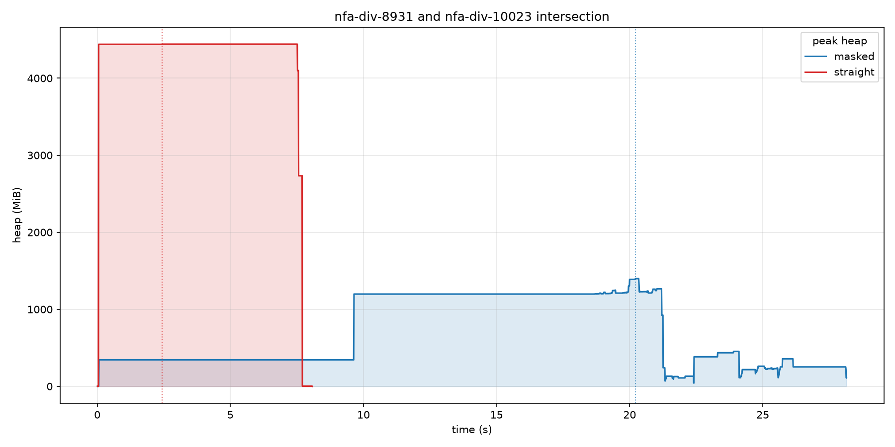
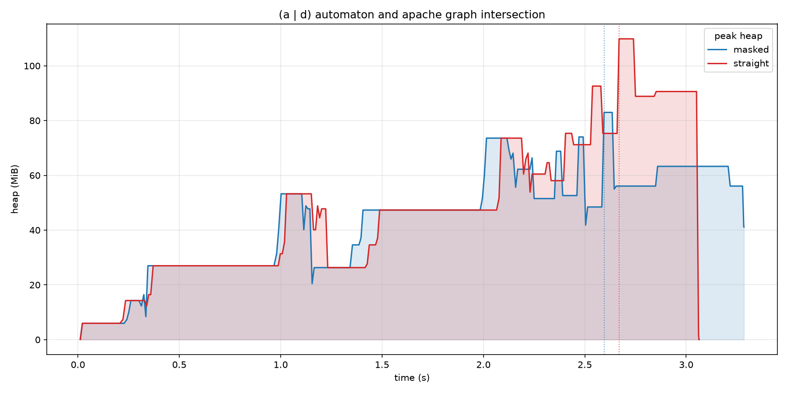
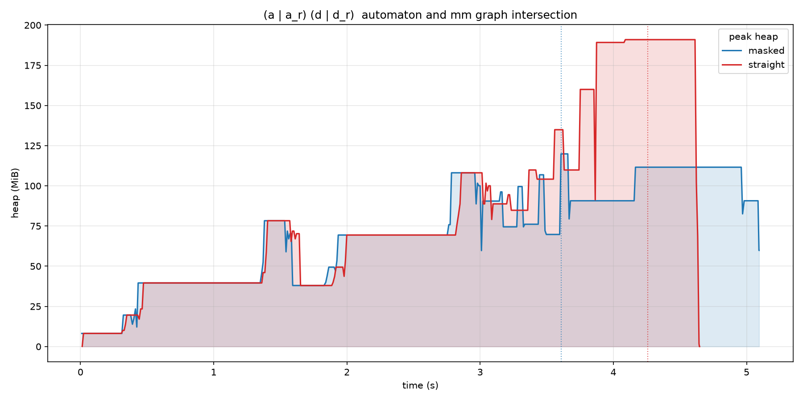
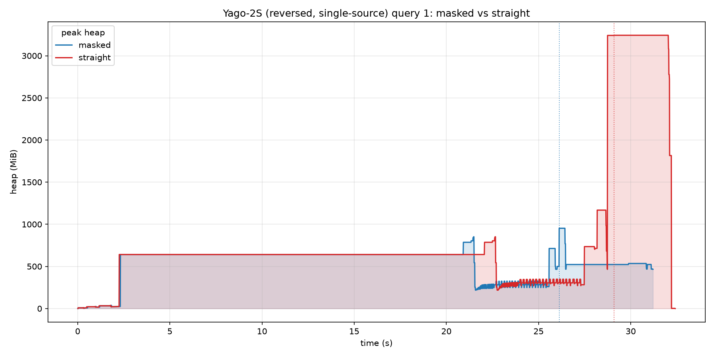
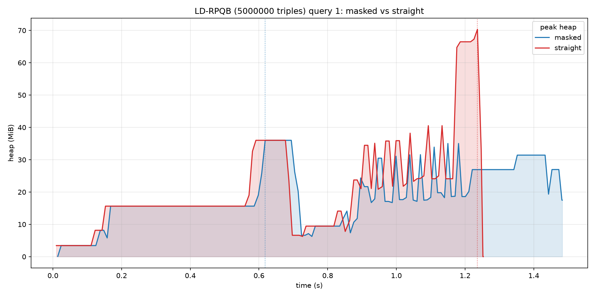

* [1. Введение](#введение)
* [2. Описание алгоритмов](#описание-алгоритмов)
* [3. Тестирование](#тестирование)
* [4. Эксперимент](#эксперимент)
    * [4.1 nfa-div-*](#nfa-div-)
        * [4.1.1 Память](#память)
        * [4.1.2 Время исполнения](#время-исполнения)
    * [4.2 CFPQ-data](#cfpq-data)
    * [4.3 Yago 2s](#yago-2s)
    * [4.4 LD-RPQB](#ld-rpqb)

# Введение
Замеры производительности алгоритмов вычисления пересечения автоматов с использованием произведения Кронекера, с маской и без неё.

# Описание алгоритмов
Оба алгоритма получают на вход размер алфавита $\Sigma$ и булевы матрицы смежности по каждому символу алфавита. Помимо этого алгоритм, использующий маску, получает на вход два вектора, элементами которых являются номера начальных состояний.
1) Произведение Кронекера без маски.
2) С использованием маски: по полученным на вход матрицам смежности строится T =  $\lor_{i \in \Sigma}$ kron($\land, F_{1_{i}}, F_{2_{i}}$). Затем по графу с матрицей смежности T запускается поиск в ширину из всех начальных состояний автомата-пересечения. Из вектора достижимых вершин и T строится маска, где Mask[i, j] = 1 $\iff$ i и j достижимы из начальных вершин и T[i, j] = 1. Эта маска применяется к последнему произведению Кронекера для вычисления матрицы смежности автомата-пересечения.

# Тестирование
Результаты пересечения с маской сравниваются с результатом пересечения автоматов pyformlang на nfa-div-* автоматах.

# Эксперимент
Эксперимент проводился на машине со следующими характеристиками: Linux Mint 22.1, Intel Core i3-7020U (4), 2.30 GHz, DDR4 8GB RAM и Intel HD Graphics 620, 1.00 GHz. $\newline$ Использовалась следующая версия GraphBLAS:  $\newline$ https://github.com/SparseLinearAlgebra/GraphBLAS/pull/1 $\newline$
Собрать можно с помощью: $\newline$

    make

В директории build будут straight и masked --- результат компиляции кода алгоритма без маски и с маской соответственно.

## Результаты

## nfa-div-*

nfa-div-* автоматы --- автоматы, построенные с помощью Chrobelias, допускающие числа в двоичной системе счисления, делящиеся
на соответствующее число (9 и 15 --- пересечение автомата, допускающего числа, кратные 9,
и автомата, допускающего числа, кратные 15).

### Память

Размер выделенной на куче памяти в пике.

| Автоматы | Пересечение без маски | Пересечение с маской
|---|---|---|
| 135; 273 | 3.9 MB | 3.1 MB |
| 303; 505 | 9.9 MB | 4.2 MB |
| 505; 605 | 17.8 MB | 11.4 MB
| 741; 1001 | 40.5 MB | 20.9 MB
| 2025; 2349| 215.3 MB | 59.6 MB |
| 4351; 8931 | 2.0 GB | 553 MB
| 8931; 10023 | 4.7 GB | 1.5 GB
| 10023; 13107 | 6.8 GB | 1.8 GB

### Время исполнения

Среднее арифметическое 5 запусков и среднеквадратичное отклонение.

GrB_NONBLOCKING
| kron(A, B) | no mask | mask
|---|---|---|
| 741; 1001 | 0.064 $\pm$ 0.001 s | 0.249 $\pm$ 0.011 s
| 2025; 2349 | 0.291 $\pm$ 0.002 s | 0.756 $\pm$ 0.003 s
| 4351; 8931 | 2.577 $\pm$ 0.016 s | 7.286 $\pm$ 0.014 s
| 8931; 10023 | 5.997 $\pm$ 0.165 s | 19.177 $\pm$ 0.046 s
| 10023; 13107 | 9.267 $\pm$ 0.165 s | 23.839 $\pm$ 0.184 s

GrB_BLOCKING
| kron(A, B) | no mask | mask
|---|---|---|
| 741; 1001 | 0.064 $\pm$ 0.001 s | 0.277 $\pm$ 0.016 s
| 2025; 2349 | 0.298 $\pm$ 0.015 s | 0.758 $\pm$ 0.002 s
| 4351; 8931 | 2.560 $\pm$ 0.003 s | 7.355 $\pm$ 0.018 s
| 8931; 10023 | 5.857 $\pm$ 0.030 s | 19.791 $\pm$ 0.016 s
| 10023; 13107 | 9.066 $\pm$ 0.279 s | 23.830 $\pm$ 0.012 s

## CFPQ-data

Пересечение автоматов, задающих регулярный язык, и графов из CFPQ_Data.
Регулярные выражения взяты случайные, в качестве начального состояния графа также взята случайная вершина.

## [apache](https://formallanguageconstrainedpathquerying.github.io/CFPQ_Data/graphs/data/apache.html#apache)

Размер выделенной на куче памяти в пике.

| Рег. выражение | Пересечение без маски | Пересечение с маской |
|---|---|---|
| a  \|  d | 115.2 MB | 87.0 MB
| (a \| a_r) (d \| d_r) | 138.1 MB | 87.0 MB
| a* | 115.2 MB | 87.0 MB
| (d a_r)* | 131.2 MB | 87.0 MB
| (a \| d_r) (a_r \| d)* | 131.2 MB | 87.0 MB

### Время исполнения

GrB_NONBLOCKING
| Рег. выражение | Пересечение без маски | Пересечение с маской |
|---|---|---|
| a  \|  d | 2.132 $\pm$ 0.003 s | 2.295 $\pm$ 0.007 s
| (a \| a_r) (d \| d_r) | 2.221 $\pm$ 0.003 s | 2.540 $\pm$ 0.004 s
| a* | 2.110 $\pm$ 0.012 s | 2.165 $\pm$ 0.004 s
| (d a_r)* | 2.200 $\pm$ 0.014 s | 2.379 $\pm$ 0.009 s
| (a \| d_r) (a_r \| d)* | 2.198 $\pm$ 0.012 s | 2.412 $\pm$ 0.013 s

GrB_BLOCKING
| Рег. выражение | Пересечение без маски | Пересечение с маской |
|---|---|---|
| a  \|  d | 2.339 $\pm$ 0.226 s | 2.337 $\pm$ 0.062 s
| (a \| a_r) (d \| d_r) | 2.236 $\pm$ 0.018 s | 2.560 $\pm$ 0.018 s
| a* | 2.181 $\pm$ 0.148 s | 2.171 $\pm$ 0.009 s
| (d a_r)* | 2.192 $\pm$ 0.004 s | 2.391 $\pm$ 0.015 s
| (a \| d_r) (a_r \| d)* | 2.201 $\pm$ 0.007 s | 2.406 $\pm$ 0.004 s

## [mm](https://formallanguageconstrainedpathquerying.github.io/CFPQ_Data/graphs/data/mm.html#mm)

Размер выделенной на куче памяти в пике.

| Рег. выражение | Пересечение без маски | Пересечение с маской |
|---|---|---|
| a  \|  d | 167.8 MB | 125.7 MB
| (a \| a_r) (d \| d_r) | 200.3 MB | 125.7 MB
| a* | 167.8 MB | 125.7 MB
| (d a_r)* | 190.1 MB | 125.7 MB
| (a \| d_r) (a_r \| d)* | 190.1 MB | 125.7 MB

### Время исполнения

GrB_NONBLOCKING
| Рег. выражение | Пересечение без маски | Пересечение с маской |
|---|---|---|
| a  \|  d | 3.158 $\pm$ 0.069 s | 3.379 $\pm$ 0.019 s
| (a \| a_r) (d \| d_r) | 3.258 $\pm$ 0.008 s | 3.721 $\pm$ 0.005 s
| a* | 3.104 $\pm$ 0.056 s | 3.165 $\pm$ 0.017 s
| (d a_r)* | 3.201 $\pm$ 0.006 s | 3.481 $\pm$ 0.006 s
| (a \| d_r) (a_r \| d)* | 3.225 $\pm$ 0.023 s | 3.514 $\pm$ 0.008 s

GrB_BLOCKING
| Рег. выражение | Пересечение без маски | Пересечение с маской |
|---|---|---|
| a  \|  d | 3.132 $\pm$ 0.015 s | 3.374 $\pm$ 0.015 s
| (a \| a_r) (d \| d_r) | 3.250 $\pm$ 0.006 s | 3.728 $\pm$ 0.014 s
| a* | 3.084 $\pm$ 0.017 s | 3.181 $\pm$ 0.019 s
| (d a_r)* | 3.217 $\pm$ 0.012 s | 3.487 $\pm$ 0.024 s
| (a \| d_r) (a_r \| d)* | 3.205 $\pm$ 0.009 s | 3.529 $\pm$ 0.020 s

# [Yago 2s](https://yago-knowledge.org/downloads/yago-2s)

Single-source [регулярные запросы](https://github.com/SparseLinearAlgebra/la-rpq/blob/main/Datasets/Yago-2S/sparql-queries.txt) на транспонированном Yago, преобразованного в MatrixMarket с помощью [la-rpq](https://github.com/SparseLinearAlgebra/la-rpq/tree/main) --- поскольку исходные запросы single destination. Запросы 5 и 6 не замерялись, поскольку в имеющейся более лёгкой версии графа нет нужных для этих запросов рёбер.

Размер выделенной на куче памяти в пике.

| Запрос | Пересечение без маски | Пересечение с маской |
|---|---|---|
| 1 | 3.4 GB | 999.0 MB
| 2 | 3.4 GB | 999.0 MB
| 3 | 3.4 GB | 999.0 MB
| 4 | 2.9 GB | 999.0 MB
| 7 | 3.4 GB | 999.0 MB

### Время исполнения

GrB_NONBLOCKING
| Запрос | Пересечение без маски | Пересечение с маской |
|---|---|---|
| 1 | 24.187 $\pm$ 0.087 s | 25.278 $\pm$ 0.051 s
| 2 | 24.237 $\pm$ 0.238 s | 26.066 $\pm$ 0.016 s
| 3 | 24.117 $\pm$ 0.017 s | 25.266 $\pm$ 0.020 s
| 4 | 23.644 $\pm$ 0.024 s | 26.389 $\pm$ 0.042 s
| 7 | 24.692 $\pm$ 0.887 s | 26.671 $\pm$ 0.061 s

GrB_BLOCKING
| Запрос | Пересечение без маски | Пересечение с маской |
|---|---|---|
| 1 | 24.492 $\pm$ 0.056 s | 25.617 $\pm$ 0.150 s
| 2 | 24.449 $\pm$ 0.028 s | 26.386 $\pm$ 0.014 s
| 3 | 24.438 $\pm$ 0.029 s | 25.556 $\pm$ 0.009 s
| 4 | 24.001 $\pm$ 0.032 s | 26.667 $\pm$ 0.020 s
| 7 | 24.625 $\pm$ 0.356 s | 27.257 $\pm$ 0.567 s

# [LD-RPQB](https://github.com/SparseLinearAlgebra/la-rpq/tree/main/Datasets/RPQBench)
Сгенерированный с помощью [la-rpq](https://github.com/SparseLinearAlgebra/la-rpq/tree/main/Datasets/RPQBench) граф и регулярные запросы к нему

Размер выделенной на куче памяти в пике.

| Запрос | Пересечение без маски | Пересечение с маской |
|---|---|---|
| 1 | 73.75 MB | 37.76 MB
| 2 | 73.75 MB | 37.76 MB
| 3 | 126.45 MB | 41.44 MB
| 4 | 126.45 MB | 41.44 MB
| 5 | 42.51 MB | 37.76 MB
| 6 | 42.51 MB | 37.76 MB
| 7 | 53.42 MB | 37.76 MB
| 8 | 53.42 MB | 37.76 MB
| 9 | 54.50 MB | 37.76 MB
| 10 | 54.50 MB | 37.76 MB
| 11 | 54.50 MB | 37.76 MB
| 12 | 54.50 MB | 37.76 MB
| 13 | 73.75 MB | 37.76 MB
| 14 | 73.75 MB | 37.76 MB
| 15 | 73.75 MB | 37.76 MB
| 16 | 73.75 MB | 37.76 MB
| 17 | 54.50 MB | 37.76 MB
| 18 | 54.50 MB | 37.76 MB
| 19 | 54.50 MB | 37.76 MB
| 20 | 54.50 MB | 37.76 MB

### Время исполнения

GrB_NONBLOCKING
| Запрос | Пересечение без маски | Пересечение с маской |
|---|---|---|
| 1 | 0.862 $\pm$ 0.014 s | 1.022 $\pm$ 0.019 s
| 2 | 0.853 $\pm$ 0.002 s | 0.994 $\pm$ 0.013 s
| 3 | 0.891 $\pm$ 0.003 s | 1.071 $\pm$ 0.004 s
| 4 | 0.894 $\pm$ 0.011 s | 1.079 $\pm$ 0.006 s
| 5 | 0.828 $\pm$ 0.003 s | 0.875 $\pm$ 0.001 s
| 6 | 0.829 $\pm$ 0.003 s | 0.876 $\pm$ 0.001 s
| 7 | 0.841 $\pm$ 0.003 s | 0.878 $\pm$ 0.006 s
| 8 | 0.843 $\pm$ 0.005 s | 1.078 $\pm$ 0.178 s
| 9 | 0.839 $\pm$ 0.003 s | 1.080 $\pm$ 0.118 s
| 10 | 0.839 $\pm$ 0.004 s | 0.881 $\pm$ 0.003 s
| 11 | 0.840 $\pm$ 0.004 s | 0.885 $\pm$ 0.003 s
| 12 | 0.839 $\pm$ 0.007 s | 0.883 $\pm$ 0.003 s
| 13 | 0.857 $\pm$ 0.002 s | 1.017 $\pm$ 0.101 s
| 14 | 0.865 $\pm$ 0.017 s | 1.149 $\pm$ 0.158 s
| 15 | 0.853 $\pm$ 0.003 s | 0.930 $\pm$ 0.007 s
| 16 | 0.855 $\pm$ 0.011 s | 0.937 $\pm$ 0.003 s
| 17 | 0.844 $\pm$ 0.005 s | 0.961 $\pm$ 0.004 s
| 18 | 0.846 $\pm$ 0.006 s | 0.958 $\pm$ 0.005 s
| 19 | 0.841 $\pm$ 0.002 s | 0.934 $\pm$ 0.006 s
| 20 | 0.850 $\pm$ 0.003 s | 0.970 $\pm$ 0.021 s

GrB_BLOCKING
| Запрос | Пересечение без маски | Пересечение с маской |
|---|---|---|
| 1 | 0.972 $\pm$ 0.006 s | 1.094 $\pm$ 0.003 s
| 2 | 0.983 $\pm$ 0.019 s | 1.090 $\pm$ 0.004 s
| 3 | 1.009 $\pm$ 0.002 s | 1.183 $\pm$ 0.012 s
| 4 | 1.010 $\pm$ 0.003 s | 1.176 $\pm$ 0.003 s
| 5 | 0.946 $\pm$ 0.003 s | 0.980 $\pm$ 0.001 s
| 6 | 0.949 $\pm$ 0.011 s | 0.986 $\pm$ 0.009 s
| 7 | 0.959 $\pm$ 0.008 s | 0.989 $\pm$ 0.015 s
| 8 | 0.959 $\pm$ 0.002 s | 0.983 $\pm$ 0.004 s
| 9 | 0.966 $\pm$ 0.005 s | 0.989 $\pm$ 0.003 s
| 10 | 0.966 $\pm$ 0.003 s | 0.989 $\pm$ 0.003 s
| 11 | 0.968 $\pm$ 0.009 s | 0.994 $\pm$ 0.014 s
| 12 | 0.967 $\pm$ 0.002 s | 0.989 $\pm$ 0.003 s
| 13 | 0.974 $\pm$ 0.005 s | 1.065 $\pm$ 0.006 s
| 14 | 0.976 $\pm$ 0.003 s | 1.069 $\pm$ 0.003 s
| 15 | 0.973 $\pm$ 0.008 s | 1.044 $\pm$ 0.028 s
| 16 | 0.973 $\pm$ 0.002 s | 1.042 $\pm$ 0.004 s
| 17 | 0.970 $\pm$ 0.005 s | 1.069 $\pm$ 0.015 s
| 18 | 0.974 $\pm$ 0.006 s | 1.071 $\pm$ 0.011 s
| 19 | 0.967 $\pm$ 0.005 s | 1.038 $\pm$ 0.004 s
| 20 | 0.971 $\pm$ 0.007 s | 1.067 $\pm$ 0.002 s
